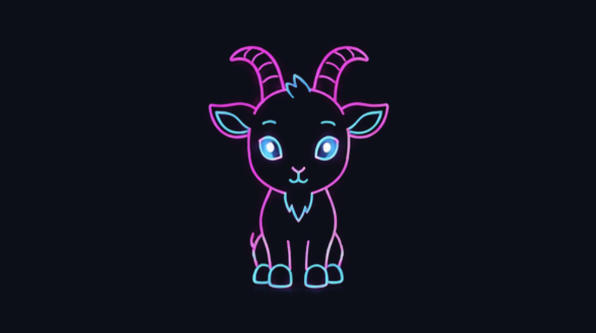

<p align="center">
  
</p>

# DeskPet 🐐

Compagnon de bureau flottant pour **macOS** : une **chèvre cyberpunk néon** qui
vit sur le bureau, se balade, réagit à l'activité en cours, garde une mémoire,
et dont l'humeur évolue avec le temps et au fil des interactions.

<p align="center">
  
</p>

## Fonctionnalités

- **Présence sur le bureau** : fenêtre transparente always-on-top ; déplacements
  autonomes (marche, course, assis, dodo, saut) avec rendu *squash & stretch*,
  et déplacement manuel à la souris.
- **Personnalité évolutive** : des jauges (énergie, affection, ennui) et des
  traits (sarcasme, tendresse) dérivent avec le temps ; croissance par stades
  (chevreau → jeune → adulte), mémoire des faits marquants, remarques spontanées
  et réaction au retour après une absence.
- **Observation de l'activité** (4 niveaux) :
  1. Nouveaux fichiers sur le Bureau / Téléchargements
  2. Captures d'écran (analysées par un modèle de vision)
  3. Application au premier plan + ouverture / fermeture d'applications
  4. Lancement / arrêt d'outils en ligne de commande (nmap, docker, hashcat…)
- **Synchronisation multi-Macs** : la mémoire et l'état sont écrits dans iCloud
  Drive ; la même chèvre est disponible sur chaque Mac.

## Prérequis

- macOS 14+ et **Swift** (les Command Line Tools suffisent : `xcode-select --install`)
- [Ollama](https://ollama.com) avec deux modèles, et le serveur lancé :
  ```sh
  ollama pull qwen2.5:14b   # texte (ou qwen2.5:7b sur une machine plus légère)
  ollama pull moondream     # vision
  ollama serve
  ```

## Lancer

```sh
swift run DeskPet
```

Build optimisé (usage quotidien / lancement au démarrage) :

```sh
swift build -c release
.build/release/DeskPet
```

## Lancement au démarrage (optionnel)

Un LaunchAgent (`~/Library/LaunchAgents/com.deskpet.plist`) pointant vers le
binaire *release* le lance à l'ouverture de session :

```sh
launchctl load -w ~/Library/LaunchAgents/com.deskpet.plist   # activer
launchctl unload ~/Library/LaunchAgents/com.deskpet.plist    # désactiver
```

## État persistant

`~/Library/Mobile Documents/com~apple~CloudDocs/DeskPet/state.json`
(repli local dans `~/Library/Application Support/DeskPet/` en l'absence d'iCloud).
Ce fichier n'est **jamais** versionné.

## Structure

| Fichier | Rôle |
|---|---|
| `PetController.swift` | Déplacement, machine à états d'animation, squash & stretch |
| `CreatureView.swift` / `GoatSprite.swift` | Rendu des sprites |
| `PetBrain.swift` | Personnalité, répliques, réactions |
| `PetState.swift` | État persistant (jauges, mémoire, croissance) + sync iCloud |
| `DesktopWatcher.swift` / `ProcessWatcher.swift` | Observation fichiers & process |
| `OllamaClient.swift` | Accès à Ollama (texte + vision) |
